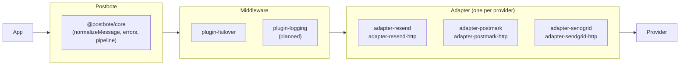

# Postbote

**Provider-agnostic email SDK for TypeScript.** One unified API for Resend, Postmark, SendGrid, and more — with middleware plugins for cross-cutting concerns like failover.

```ts
import { createPostbote } from "@postbote/core";
import { resend } from "@postbote/adapter-resend";

const postbote = createPostbote({
  adapter: resend({ apiKey: env.RESEND_KEY }),
});

const result = await postbote.send({
  from: "Acme <onboarding@acme.com>",
  to: "user@example.com",
  subject: "Welcome",
  text: "Hello!",
});
```

## Packages

| Package | Description |
|---|---|
| [`@postbote/core`](./packages/core) | Message model, `Adapter` contract, error handling, middleware pipeline |
| [`@postbote/adapter-resend`](./packages/adapter-resend) | Resend — native SDK |
| [`@postbote/adapter-resend-http`](./packages/adapter-resend-http) | Resend — fetch-based, zero SDK deps |
| [`@postbote/adapter-postmark`](./packages/adapter-postmark) | Postmark — native SDK |
| [`@postbote/adapter-postmark-http`](./packages/adapter-postmark-http) | Postmark — fetch-based, zero SDK deps |
| [`@postbote/adapter-sendgrid`](./packages/adapter-sendgrid) | SendGrid — native `@sendgrid/mail` SDK |
| [`@postbote/adapter-sendgrid-http`](./packages/adapter-sendgrid-http) | SendGrid — fetch-based, zero SDK deps |
| [`@postbote/plugin-failover`](./packages/plugin-failover) | Automatic provider failover |
| [`@postbote/adapter-contract`](./packages/adapter-contract) | Contract test suite for adapter authors |
| [`@postbote/testing`](./packages/testing) | Test kit (TestInbox, error simulation, matchers) |

## Architecture



## Install

```bash
pnpm add @postbote/core @postbote/adapter-resend
```

All packages are ESM-only, require Node >= 20.19, and ship as pre-built `.js` + `.d.ts`.

## Guides

- [Write your own adapter](./packages/adapter-contract/README.md) — use the contract suite
- [Write your own plugin](./packages/core/README.md) — middleware pipeline API
- [Testing email code](./packages/testing/README.md) — without sending real emails
- [Failover setup](./packages/plugin-failover/README.md) — multi-provider resilience

## What Postbote is NOT

- ❌ No email rendering/templating
- ❌ No queue, scheduling, or "send later"
- ❌ No browser usage (API keys belong server-side)
- ❌ No analytics/tracking pixels
- ❌ No contact/list management — transactional email only

## Contributing

See [CONTRIBUTING.md](./CONTRIBUTING.md).

## License

MIT &mdash; see [LICENSE.md](./LICENSE.md).
